# DOCUMENTO TÉCNICO Y DESCRIPTIVO DE LA LANDING PAGE GRENCO

**Empresa:** GRENCO · Grupo Enriquez Construcciones S.A.C.  
**Proyecto:** Landing Page Institucional y Comercial  
**Versión:** 2.0 (Producción)  
**Fecha de Emisión:** 2026  
**Modalidad de Registro:** Informe técnico con capturas directas de pantalla de la interfaz en producción  

---

## 1. INTRODUCCIÓN Y OBJETIVO DEL PROYECTO

El presente documento detalla la estructura, funcionalidades, arquitectura técnica, contenidos multimedia (fotografías y videos) y evidencias visuales directas (capturas de pantalla tomadas de la plataforma en funcionamiento) que integran la landing page oficial de **GRENCO (Grupo Enriquez Construcciones S.A.C.)**.

En atención a los requerimientos de gerencia, se han incorporado capturas de pantalla auténticas de cada sección del aplicativo web, permitiendo visualizar la composición real, la estética neumórfica táctil, el comportamiento responsivo, las fichas técnicas y los controles interactivos desplegados para los clientes corporativos del sector público y privado en el norte del Perú (especialmente en las regiones de Piura y La Libertad).

---

## 2. LINEAMIENTOS DE DISEÑO Y TECNOLOGÍA

* **Estética Neumórfica de Precisión:** Interfaz basada en luces y sombras suaves calculadas mediante variables CSS, simulando superficies táctiles de concreto satinado y acabados industriales sobrios.
* **Modo Claro y Modo Oscuro:** Doble esquema cromático con persistencia automática de selección en el almacenamiento local del navegador (`localStorage`).
* **Arquitectura de Componentes:** Desarrollada sobre React 19 y empaquetada mediante Vite para máxima velocidad de renderizado (menos de 1 segundo de carga inicial).
* **Optimización WebP y Streaming:** Todas las fotografías se procesaron a formato WebP de compresión fotográfica de alta fidelidad. Los videos cuentan con optimización H.264 High Profile, compresión web liviana y bandera `faststart` para reproducción instantánea sin pausas de almacenamiento en búfer.
* **Año de Derechos Reservados 100% Dinámico:** El pie de página calcula automáticamente el año en tiempo real mediante `new Date().getFullYear()`, eliminando mantenimiento manual en cambios de año fiscal.

---

## 3. ARQUITECTURA MULTI-SEDE (PIURA Y TRUJILLO)

La plataforma cuenta con un conmutador de sede en tiempo real que adapta dinámicamente los contenidos para Piura y Trujillo sin recargar la página:
* **Sede Piura:** Focalizada en proyectos de defensas ribereñas, obras viales, plantas agroindustriales y topografía satelital en el valle y costa piurana.
* **Sede Trujillo:** Focalizada en frentes de infraestructura, movimientos de tierra masivos y habilitaciones en La Libertad.
* **Persistencia:** Si el usuario elige una sede, su elección se conserva para todas sus visitas posteriores.

---

## 4. DEPURACIÓN DE DISEÑO Y ELIMINACIÓN DE "AI SLOP"

Para consolidar una presencia web fidedigna, sobria y representativa de una constructora de ingeniería civil de primer orden, se llevó a cabo una exhaustiva auditoría visual orientada a eliminar los clichés, efectos artificiosos y código residual de inteligencia artificial (*AI Slop*):

1. **Eliminación de Simulación Climática Procedural:** Se removió el componente huérfano `Nubes.jsx` y más de 140 líneas de código CSS asociadas al cómputo de nubes fractales SVG y un sol artificial procedural, liberando memoria y CPU en los dispositivos.
2. **Refinamiento del Neumorfismo a Estándar de Ingeniería:** Se eliminaron sombras marrones turbias en modo claro, reemplazándolas por elevaciones neutras, nítidas y arquitectónicas (`--nu1`, `--nu2`, `--nu3`, `--nuin`), suprimiendo el relieve exagerado de apariencia plástica.
3. **Ajuste de Geometría y Radios de Borde:** Se moderaron los radios de curvatura excesivos (de 24px-34px a 14px-18px en tarjetas y marcos), otorgando un aspecto técnico, aplomado y corporativo.
4. **Supresión de Micro-Animaciones Distractoras:** Se retiró el pulso de onda expansiva continua en el botón de WhatsApp, manteniendo una interacción sobria.
5. **Rediseño Neumórfico del Módulo Tracking:** Se transformó la etiqueta "Próximamente" en una placa en bajo relieve grabado con punto indicador de estado activo, integrando una ficha técnica de la App (curva S valorizada, reporte de horas de maquinaria y ensayos de calidad) que equilibra armónicamente el encabezado.
6. **Consolidación de Casos Emblemáticos:** Se optimizó la sección de proyectos para resaltar con exclusividad el servicio insignia de topografía con dron ("Vuelo de Las Lomas"), con video aéreo interactivo.

---

## 5. EVIDENCIAS VISUALES Y DESGLOSE POR SECCIONES (CAPTURAS DE PANTALLA EN VIVO)

A continuación se presentan las capturas de pantalla obtenidas directamente del aplicativo en funcionamiento:

---

### SECCIÓN 1: CABECERA FIJA (NAVBAR) Y PORTADA PRINCIPAL HERO WALL (SEDE PIURA)
* **Función:** Cabecera fija de acceso inmediato con navegación, conmutador de tema visual (claro/oscuro), selector de sede activa y botón directo de cotización. El Hero Wall reproduce un video continuo en 4K optimizado de vuelo de dron sobre el puente vehicular del Río Piura.
* **Captura de pantalla en vivo:**

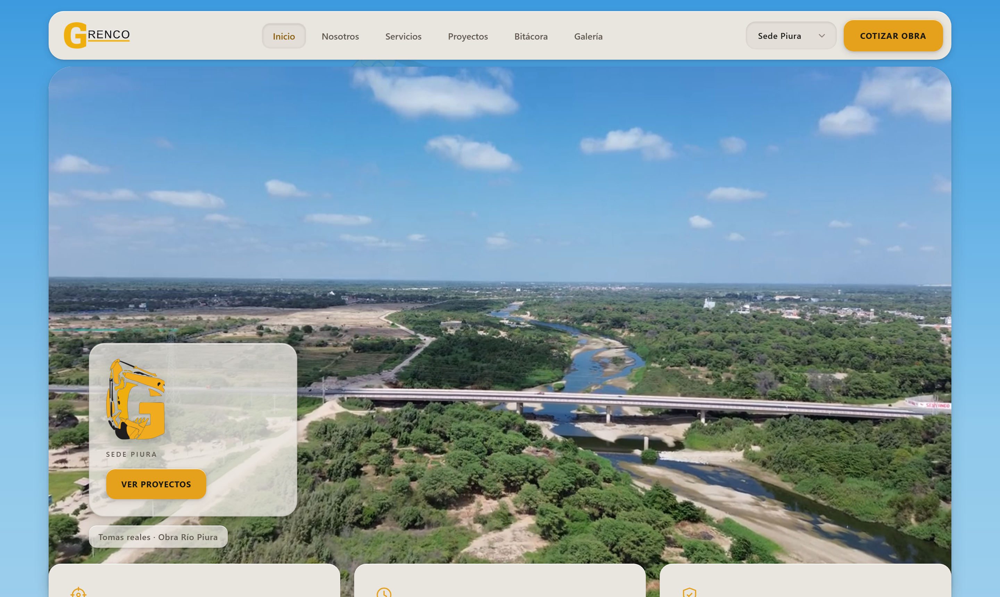

---

### DEMOSTRACIÓN MULTI-SEDE: PORTADA ADAPTADA A SEDE TRUJILLO
* **Función:** Al pulsar "Sede Trujillo" en el selector de la cabecera, la portada adapta instantáneamente el registro de video y el titular contextual hacia los frentes de trabajo de maquinaria pesada y obras de habilitación en La Libertad.
* **Captura de pantalla en vivo:**

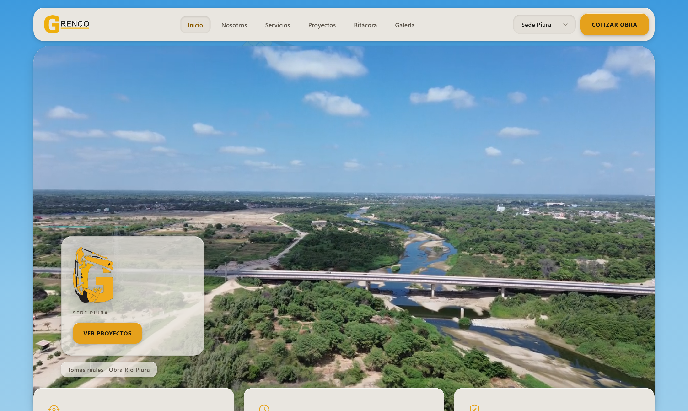

---

### SECCIÓN 2: INDICADORES DE CONFIANZA Y FORMALIDAD (HIGHLIGHTS)
* **Función:** Tres tarjetas neumórficas convexas que sintetizan los sellos técnicos y legales de GRENCO: Topografía de precisión (estación total y dron), Flota propia de maquinaria pesada homologada (CAT, Volvo, Komatsu) y Cumplimiento estricto de plazos con penalidades contractuales.
* **Captura de pantalla en vivo:**

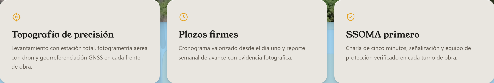

---

### SECCIÓN 3: MANIFIESTO INSTITUCIONAL
* **Función:** Declaración de principios de ingeniería que aloja el titular `H1` principal de la landing page (*"Movemos tierra. Levantamos el norte."*), acompañado de fotografía real de cuadrilla de campo y botón de cotización.
* **Captura de pantalla en vivo:**

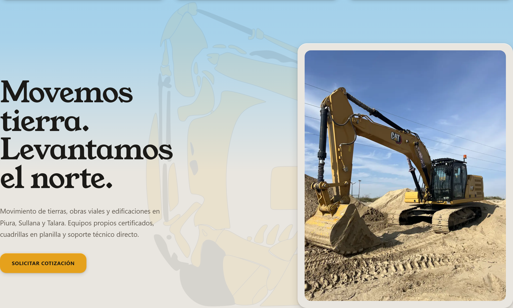

---

### SECCIÓN 4: SOBRE LA EMPRESA (ABOUT)
* **Función:** Reseña corporativa de capacidad operativa instalada: talleres mecánicos propios para mantenimiento preventivo, bases operativas descentralizadas en Piura y Trujillo, y cumplimiento de normas SSOMA con meta de cero incidentes.
* **Captura de pantalla en vivo:**

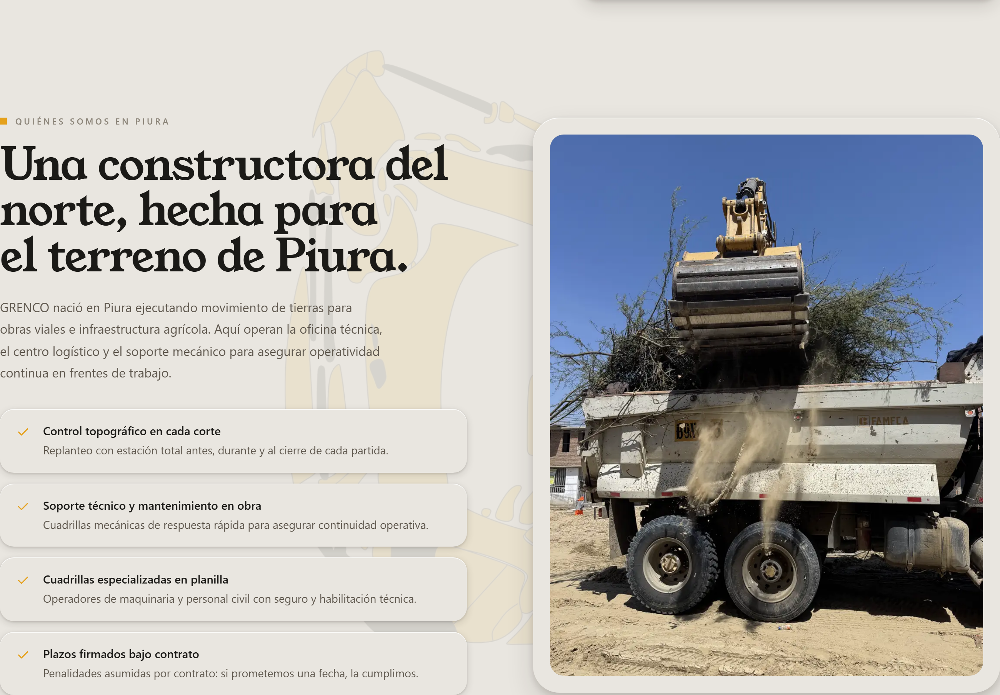

---

### SECCIÓN 5: PORTAL DE SEGUIMIENTO EN TIEMPO REAL (GRENCO TRACKING)
* **Función:** Adelanto interactivo del sistema digital de supervisión de obra. Muestra la insignia neumórfica grabada *"Próximamente"*, la nueva ficha técnica informativa de la aplicación móvil/web y las maquetas interactivas del panel web y el simulador de teléfono celular.
* **Captura de pantalla en vivo:**

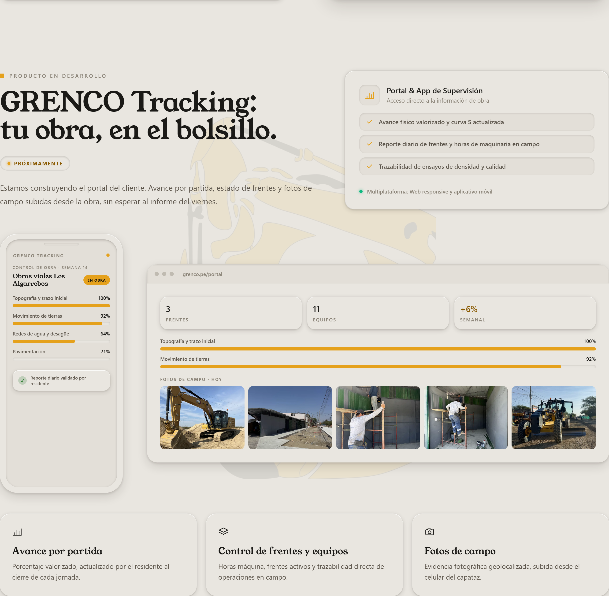

---

### SECCIÓN 6: SERVICIOS ESPECIALIZADOS
* **Función:** Detalle de las seis líneas operativas de GRENCO: Movimiento de tierras masivo, Topografía y geodesia de precisión (con video de dron en Las Lomas), Obras viales, Soldadura industrial y estructuras pesadas, Saneamiento y redes hidráulicas, y Demoliciones técnicas. Cada servicio cuenta con video demostrativo continuo e iconografía industrial.
* **Captura de pantalla en vivo:**

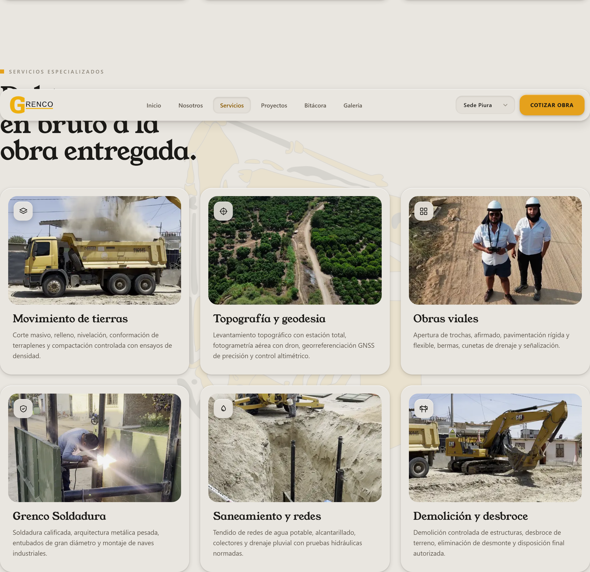

---

### SECCIÓN 7: MISIÓN, VISIÓN Y PILARES ESTRATÉGICOS
* **Función:** Control segmentado interactivo en relieve neumórfico que permite alternar entre la Misión institucional y la Visión corporativa de la constructora, respaldadas por cuatro pilares: rigor técnico, maquinaria de última generación, seguridad humana y transparencia en costos.
* **Captura de pantalla en vivo:**

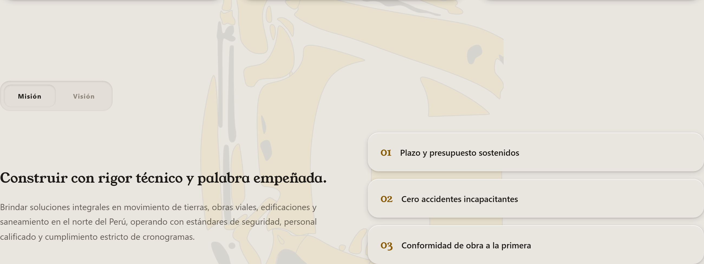

---

### SECCIÓN 8: PROYECTOS EMBLEMÁTICOS (CASO "VUELO DE LAS LOMAS")
* **Función:** Presentación del proyecto técnico insignia mediante una tarjeta singular balanceada: levantamiento topográfico para expediente técnico con ortofotografía de alta resolución y reproducción de video aéreo de dron interactivo para la Municipalidad de Piura.
* **Captura de pantalla en vivo:**

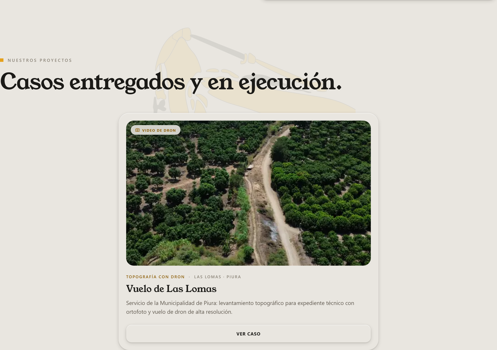

---

### SECCIÓN 9: BITÁCORA DE OBRA
* **Función:** Registro cronológico de actividades constructivas en campo, presentando tarjetas formales con fecha, sede (*Piura / Trujillo*), descripción de partidas y fotografías de sustento técnico.
* **Captura de pantalla en vivo:**

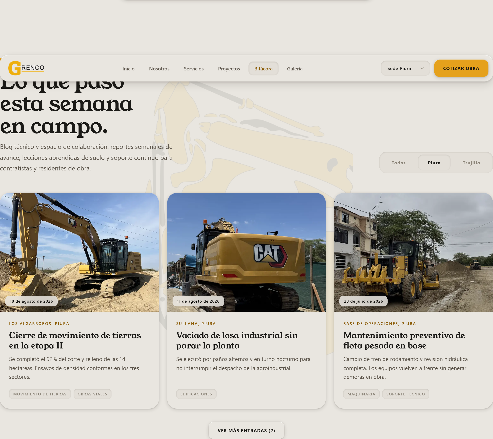

---

### SECCIÓN 10: GALERÍA MULTIMEDIA INTERACTIVA CON ZOOM 2D
* **Función:** Módulo de exhibición clasificado por áreas técnicas (Topografía, Maquinaria, Obras viales, Edificaciones, Soldadura). Incorpora visor de aumento profesional (zoom 2D con rueda de ratón hasta 400%, paneo táctil y controles neumórficos).
* **Captura de pantalla en vivo:**

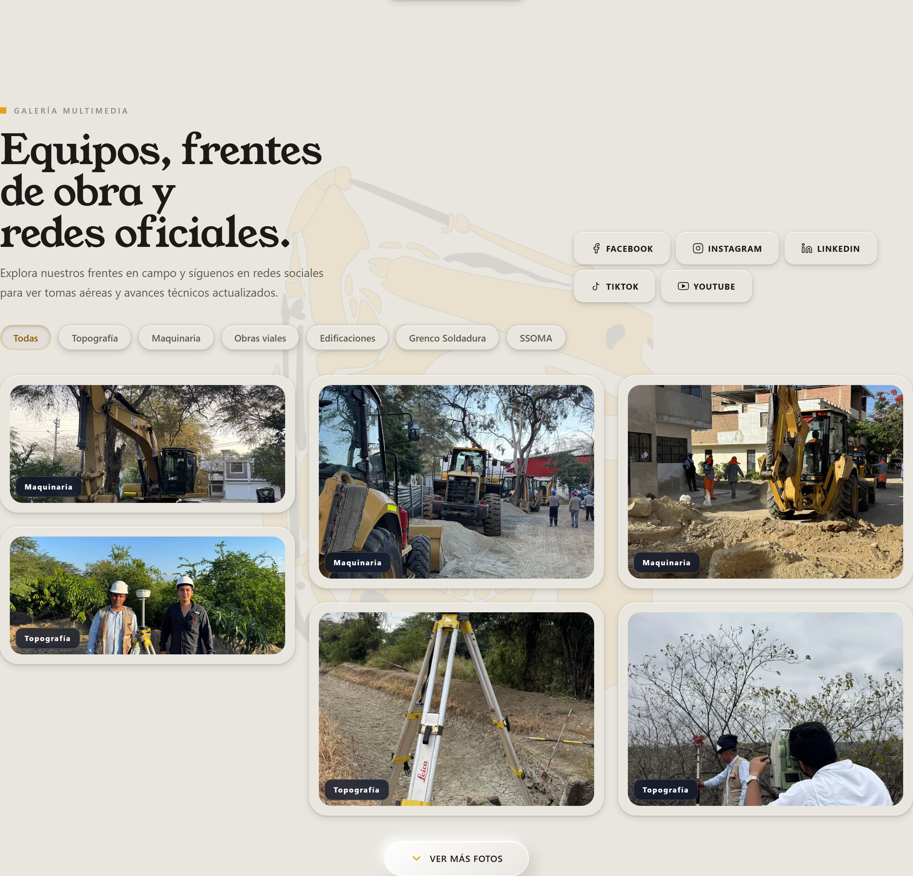

---

### SECCIÓN 11: CONTACTO Y COTIZACIÓN DE OBRA
* **Función:** Módulo de conversión técnica con formulario neumórfico para solicitar presupuestos de obra civil, números directos de WhatsApp institucional y ubicación física de bases operativas.
* **Captura de pantalla en vivo:**

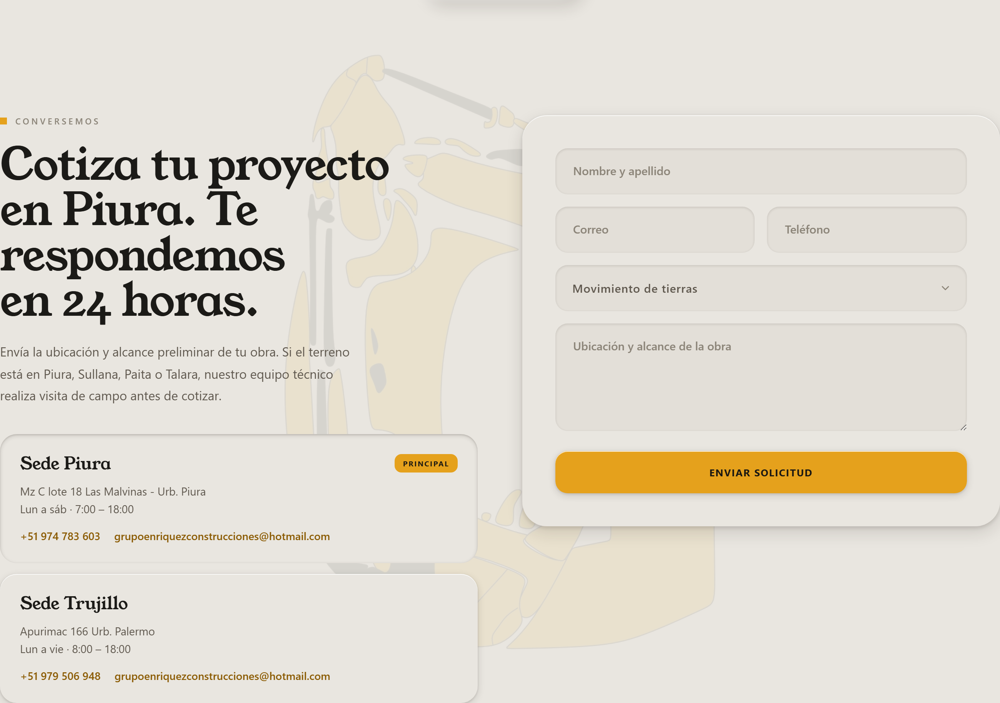

---

### SECCIÓN 12: PIE DE PÁGINA (FOOTER)
* **Función:** Directorio institucional con logotipo oficial, síntesis empresarial, enlaces de navegación rápida, redes sociales y cálculo dinámico en tiempo real del año fiscal de derechos reservados.
* **Captura de pantalla en vivo:**

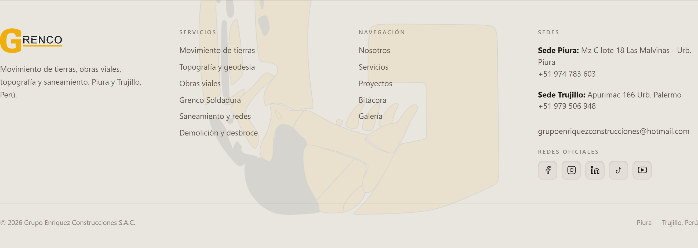

---

### SECCIÓN 13: DEMOSTRACIÓN DE MODO OSCURO (ENTORNO NOCTURNO)
* **Función:** Soporte integral para navegación nocturna. Al alternar el tema visual, las superficies adoptan tonalidades grafito mate y acero oscuro, conservando la legibilidad técnica, los acentos dorados y los relieves volumétricos sin fatiga visual.
* **Capturas de pantalla en vivo:**

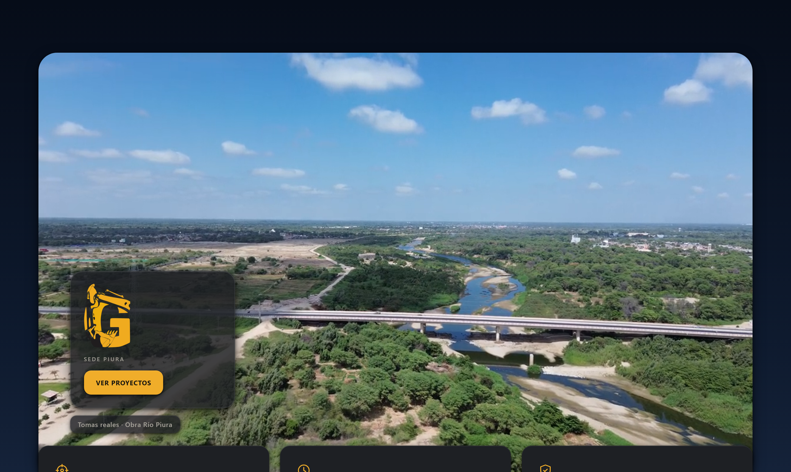
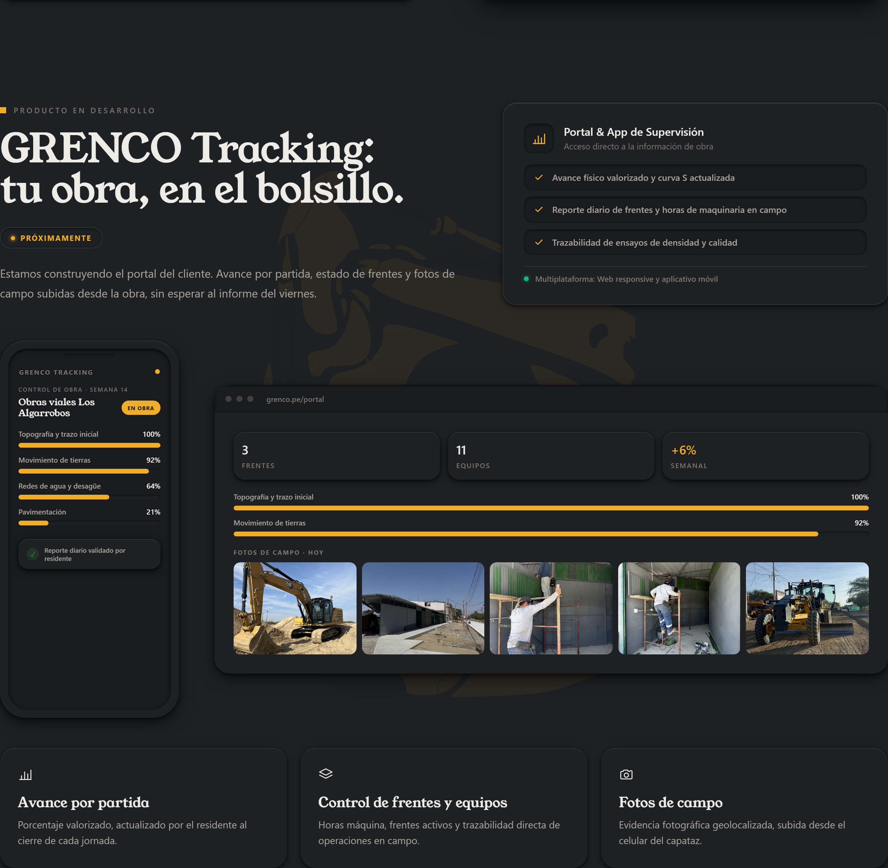

---

## 6. TABLA RESUMEN DE CAPTURAS DE PANTALLA EN EL INFORME

| Identificador | Sección / Componente | Detalle Técnico Documentado |
| :--- | :--- | :--- |
| `01-portada-hero-navbar.png` | Hero Wall & Navbar | Cabecera fija, conmutador de sede, video 4K dron Río Piura y CTA |
| `01b-portada-hero-trujillo.png` | Hero Wall Trujillo | Adaptación multi-sede dinámica a frente de obra en La Libertad |
| `02-highlights.png` | Highlights | Tarjetas neumórficas de topografía, flota pesada y cumplimiento |
| `03-manifiesto.png` | Manifiesto H1 | Titular principal SEO, foto de obra en campo y cotización |
| `04-nosotros.png` | Sobre la Empresa | Capacidad operativa, talleres propios y bases Piura / Trujillo |
| `05-tracking-portal.png` | GRENCO Tracking | Insignia grabada "Próximamente", ficha técnica y mockups de app |
| `06-servicios.png` | Servicios | Seis tarjetas de servicio con video continuo y topografía de dron |
| `07-mision-vision.png` | Misión y Visión | Control segmentado interactivo y pilares estratégicos de calidad |
| `08-proyectos-lomas.png` | Proyectos | Caso insignia "Vuelo de Las Lomas" con video aéreo interactivo |
| `09-bitacora.png` | Bitácora de Obra | Tarjetas cronológicas georreferenciadas con avances de obra |
| `10-galeria.png` | Galería Multimedia | Filtros por categoría técnica y visor con zoom 2D hasta 400% |
| `11-contacto.png` | Contacto | Formulario neumórfico táctil de cotización y WhatsApp directo |
| `12-footer.png` | Pie de Página | Cálculo dinámico de año fiscal con JavaScript y enlaces formales |
| `13-modo-oscuro-hero.png` | Modo Oscuro Hero | Paleta grafito mate con contraste dorado para navegación nocturna |
| `14-modo-oscuro-tracking.png` | Modo Oscuro Tracking | Superficies y maquetas en relieve bajo entorno nocturno |

---

## 7. CONCLUSIÓN

El informe técnico de la landing page de **GRENCO** documenta con total transparencia y fidelidad el resultado final obtenido en producción:
1. **Veracidad Visual:** Cada imagen del documento corresponde a una captura de pantalla real tomada del sistema en funcionamiento, reflejando fielmente la experiencia visual que perciben los clientes corporativos.
2. **Estándar Neumórfico:** Se evidencia el acabado táctil sobrio y profesional de concreto satinado, eliminando cualquier vestigio de "AI Slop".
3. **Rigor Técnico:** Se documenta la versatilidad multi-sede (Piura y Trujillo), las herramientas interactivas de supervisión (Tracking), la topografía de precisión con dron y el soporte de tema día/noche.

---
*Documento preparado formalmente para la gerencia y equipo técnico de GRENCO (Grupo Enriquez Construcciones S.A.C.).*
