# DOCUMENTO TÉCNICO Y DESCRIPTIVO DE LA LANDING PAGE GRENCO

**Empresa:** GRENCO · Grupo Enriquez Construcciones S.A.C.  
**Proyecto:** Landing Page Institucional y Comercial  
**Versión:** 2.0  
**Fecha de Emisión:** 2026  
**Estado:** Producción  

---

## 1. INTRODUCCIÓN Y OBJETIVO DEL PROYECTO

El presente documento detalla la estructura, funcionalidades, arquitectura técnica, contenidos multimedia (fotografías y videos) y secciones desarrolladas para la landing page oficial de **GRENCO (Grupo Enriquez Construcciones S.A.C.)**.

La plataforma ha sido diseñada con un enfoque de alto nivel técnico y comercial, orientada a clientes corporativos del sector público y privado en el norte del Perú (especialmente en las regiones de Piura y La Libertad). Su propósito principal es transmitir solidez estructural, solvencia operativa, cumplimiento estricto de plazos y capacidad técnica en movimiento de tierras, obras civiles, habilitación urbana, edificaciones, soldadura y saneamiento.

---

## 2. LINEAMIENTOS DE DISEÑO Y TECNOLOGÍA

* **Estética Neumórfica de Precisión:** Interfaz basada en luces y sombras suaves calculadas mediante variables CSS, simulando superficies táctiles de concreto satinado y acabados industriales sobrios.
* **Modo Claro y Modo Oscuro:** Doble esquema cromático con persistencia automática de selección en el almacenamiento local del navegador (`localStorage`).
* **Arquitectura de Componentes:** Desarrollada sobre React 19 y empaquetada mediante Vite para máxima velocidad de renderizado (menos de 1 segundo de carga inicial).
* **Optimización WebP y Streaming:** Todas las fotografías se procesaron a formato WebP de compresión fotográfica de alta fidelidad. Los videos cuentan con optimización H.264 High Profile, compresión web liviana y bandera `faststart` para reproducción instantánea sin pausas de almacenamiento en búfer.
* **Año de Derechos Reservados 100% Dinámico:** El pie de página calcula automáticamente el año en tiempo real mediante `new Date().getFullYear()`, eliminando mantenimiento manual en cambios de año fiscal.

---

## 3. ARQUITECTURA MULTI-SEDE (PIURA Y TRUJILLO)

La plataforma cuenta con un conmutador de sede en tiempo real que adapta dinámicamente los contenidos para Piura y Trujillo sin recargar la página:
* **Sede Piura:** Focalizada en proyectos de defensas ribereñas, obras viales, plantas agroindustriales y topografía satelital en el valle y costa piurana.
* **Sede Trujillo:** Focalizada en frentes de infraestructura, movimientos de tierra masivos y habilitaciones en La Libertad.
* **Persistencia:** Si el usuario elige una sede, su elección se conserva para todas sus visitas posteriores.

---

## 4. DEPURACIÓN DE DISEÑO Y ELIMINACIÓN DE "AI SLOP"

Para consolidar una presencia web fidedigna, sobria y representativa de una constructora de ingeniería civil de primer orden, se llevó a cabo una exhaustiva auditoría visual orientada a eliminar los clichés, efectos artificiosos y código residual de inteligencia artificial (*AI Slop*):

1. **Eliminación de Simulación Climática Procedural:**
   * Se removió el componente huérfano `Nubes.jsx` y más de 140 líneas de código CSS asociadas al cómputo de nubes fractales SVG y un sol artificial procedural. Esto libera recursos de hardware, memoria y CPU en los dispositivos de los clientes.
2. **Refinamiento del Neumorfismo a Estándar de Ingeniería:**
   * Se eliminaron las sombras marrones turbias en modo claro, reemplazándolas por elevaciones neutras, nítidas y arquitectónicas (`--nu1`, `--nu2`, `--nu3`, `--nuin`).
   * Se suprimió el relieve diagonal exagerado con apariencia de "plastilina hinchada", proyectando ahora la textura firme y sólida del concreto y el acero estructural.
3. **Ajuste de Geometría y Radios de Borde:**
   * Se moderaron los radios de curvatura excesivos (de 24px-34px a 14px-18px en tarjetas y marcos de fotografía de obra), otorgando un aspecto más técnico, aplomado y corporativo.
4. **Supresión de Micro-Animaciones Distractoras:**
   * Se retiró el pulso de onda expansiva continua en el botón flotante de WhatsApp (`.wa__pulse`), manteniendo una interacción limpia y enfocada sin distracciones permanentes.
5. **Preservación de Componentes Clave Validados:**
   * **Barra fija superior de 3px (`.progreso`):** Se mantuvo activa y vinculada al desplazamiento vertical para proporcionar una referencia visual sutil del avance de lectura.
   * **Módulo GRENCO Tracking:** Se preservaron íntegros los mockups de control de obra (aplicación móvil y portal del cliente) con sus indicadores de avance valorizado y asignación de cuadrillas.

---

## 5. DESGLOSE DETALLADO DE SECCIONES

---

### SECCIÓN 1: BARRA DE NAVEGACIÓN SUPERIOR (NAVBAR)
* **Función:** Cabecera fija de acceso inmediato, navegación rápida y herramientas de personalización.
* **Elementos que incluye:**
  1. Logotipo institucional e isotipo de GRENCO (en versiones contrastadas para modo claro y modo oscuro).
  2. Barra de lectura superior dorada de 3px (`.progreso`) que avanza suavemente con el scroll.
  3. Enlaces directos con detección de scroll activo (*ScrollSpy*): Inicio, Nosotros, Servicios, Proyectos, Bitácora, Galería y Contacto.
  3. Selector de sede interactivo con dos pestañas táctiles: **Piura** y **Trujillo**.
  4. Conmutador de tema visual (Sol / Luna) para alternar entre modo claro y oscuro.
  5. Botón de llamada a la acción principal: *"Cotizar obra"*.
* **Imágenes incluidas:**
  * Logotipo versión fondo claro: `src/assets/brand/grenco-lockup-light.webp`
  * Logotipo versión fondo oscuro: `src/assets/brand/grenco-lockup-dark.webp`

---

### SECCIÓN 2: PORTADA PRINCIPAL (HERO WALL)
* **Función:** Primer impacto visual de la landing page. Presenta tomas cinematográficas reales de frentes de obra ejecutados por la empresa.
* **Elementos que incluye:**
  1. Marca de agua centralizada del isotipo GRENCO en relieve neumórfico.
  2. Subtítulo institucional con indicador de sede activa.
  3. Botón de acción rápida: *"Ver proyectos"*.
  4. Indicador de desplazamiento inferior (*Scroll hint*).
* **Videos incluidos (Descripciones Técnicas):**
  * **Video Hero Piura (`/video/piura-hero.mp4` - 12.0 Segundos):**
    * *Descripción:* Toma aérea cinematográfica registrada en resolución 4K y optimizada a 720p 30fps para web. Muestra un vuelo frontal de dron sobre el puente vehicular del Río Piura, capturando el tránsito continuo de vehículos pesados y livianos, el cauce del río y el horizonte de la ciudad con cielo abierto.
    * *Comportamiento:* Video único en bucle continuo y suave (`loop`), sin cortes ni botones de parte para una presentación panorámica ininterrumpida.
    * *Póster WebP companion:* `/video/piura-hero.webp` (Carga ultrarrápida previa a la reproducción).
  * **Video Hero Trujillo (`/video/trujillo.mp4` - 14.0 Segundos):**
    * *Descripción:* Registro aéreo sobre frente de obra civil en Trujillo (La Libertad), documentando maquinaria en movimiento, cuadrillas de campo y obras de habilitación.
    * *Póster WebP companion:* `/video/trujillo.webp`.

---

### SECCIÓN 3: MÉTRICAS CLAVE Y DIFERENCIALES (HIGHLIGHTS)
* **Función:** Transmitir credibilidad técnica y formalidad legal frente a competidores informales.
* **Elementos que incluye:**
  * **Cuadrillas en Planilla:** Personal técnico y obrero asegurado, con seguro SCTR y cumplimiento laboral.
  * **Flota Propia Certificada:** Maquinaria pesada propia con revisiones técnicas y operadores homologados.
  * **Cumplimiento de Plazos:** Cronogramas de avance valorizado con penalidades contractuales asumidas.
  * **Estándar SSOMA:** Cero accidentes incapacitantes mediante protocolos de seguridad y salud en el trabajo.

---

### SECCIÓN 4: MANIFIESTO INSTITUCIONAL
* **Función:** Declaración de principios de ingeniería y posicionamiento SEO primario de la empresa (contiene el encabezado `H1` principal).
* **Texto destacado:** *"Movemos tierra. Levantamos el norte."*
* **Elementos que incluye:** Exposición del compromiso constructivo de GRENCO en la transformación física de la región norte.
* **Imágenes incluidas:**
  * Fotografía de cuadrilla en obra con marco de profundidad: `src/assets/obra/obra-0082.webp`

---

### SECCIÓN 5: SOBRE LA EMPRESA (ABOUT)
* **Función:** Reseña corporativa, trayectoria y cobertura geográfica.
* **Elementos que incluye:**
  * Resumen de capacidad instalada en talleres y bases operativas de Piura y Trujillo.
  * Especialidades: Obras viales, habilitaciones urbanas, canales de regadío, plantas agroindustriales y defensas ribereñas.
* **Imágenes incluidas:**
  * Registro de campo en movimiento de tierras: `src/assets/obra/obra-1718.webp`

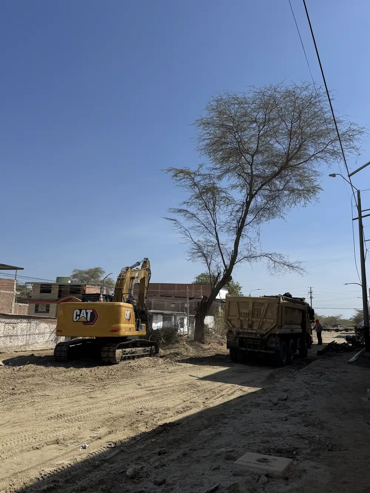

---

### SECCIÓN 6: PORTAL DE SEGUIMIENTO EN TIEMPO REAL (TRACKING)
* **Función:** Demostración de control transparente de avance de obra para clientes y entidades supervisoras.
* **Elementos que incluye:**
  * Insignia neumórfica táctil grabada en la superficie (*"Próximamente"*), con punto indicador de estado activo.
  * Ficha técnica de supervisión de la aplicación al costado del encabezado: control de avance valorizado, curva S diaria, reporte de horas de maquinaria pesada, cuadrillas en frente y trazabilidad de ensayos de calidad.
  * Maquetas interactivas en doble entorno: simulador de aplicativo móvil con barras dinámicas de porcentaje y panel de control web (`grenco.pe/portal`) con métricas clave de obra.
  * Tira continua de fotos de campo procesadas con metadatos de obra.
* **Imágenes incluidas:**
  * Selección de fotografías de campo (`obra-0186.webp`, `obra-1012.webp`, `obra-1096.webp`, `obra-1728.webp`, `obra-1844.webp`).

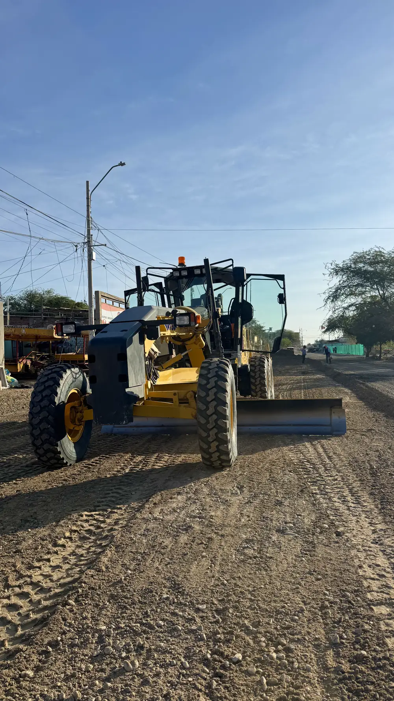
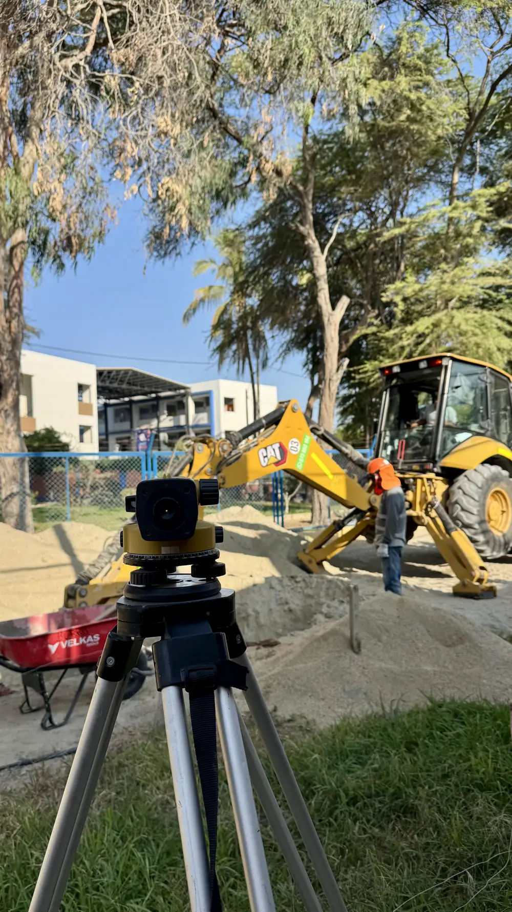

---

### SECCIÓN 7: SERVICIOS ESPECIALIZADOS
* **Función:** Detalle técnico de las seis líneas de servicio que ofrece GRENCO. Cada servicio cuenta con tarjeta neumórfica, ficha descriptiva y video demostrativo en bucle continuo.
* **Servicios y Videos incluidos (Descripciones Técnicas):**
  1. **Movimiento de Tierras:**
     * *Video:* `/video/servicios/servicio-movimiento.mp4` (Póster: `servicio-movimiento.webp`)
     * *Descripción:* Excavadoras sobre orugas realizando corte masivo de terreno, carguío a volquetes y perfilado de taludes.
  2. **Habilitación Urbana y Rasantes:**
     * *Video:* `/video/servicios/servicio-habilitacion.mp4` (Póster: `servicio-habilitacion.webp`)
     * *Descripción:* Motoniveladora y rodillo compactador conformando subrasante y terraplén para vías de acceso.
  3. **Obras Civiles y Edificaciones:**
     * *Video:* `/video/servicios/servicio-obras-civiles.mp4` (Póster: `servicio-obras-civiles.webp`)
     * *Descripción:* Encofrado, vaciado de concreto estructural y cimentaciones para naves industriales y colegios.
  4. **Soldadura y Estructuras Metálicas:**
     * *Video:* `/video/servicios/servicio-soldadura.mp4` (Póster: `servicio-soldadura.webp`)
     * *Descripción:* Operadores especializados en soldadura por arco y armado de vigas reticuladas y tuberías de conducción.
  5. **Saneamiento y Redes Hidráulicas:**
     * *Video:* `/video/servicios/servicio-saneamiento.mp4` (Póster: `servicio-saneamiento.webp`)
     * *Descripción:* Zanjeo con retroexcavadora e instalación de tuberías para redes de agua potable, alcantarillado y drenaje pluvial.
  6. **Demoliciones Técnicas y Eliminación:**
     * *Video:* `/video/servicios/servicio-demolicion.mp4` (Póster: `servicio-demolicion.webp`)
     * *Descripción:* Demolición controlada de estructuras de concreto y retiro de material con volquetes de alto tonelaje.

---

### SECCIÓN 8: MISIÓN, VISIÓN Y VALORES
* **Función:** Marco de gobierno corporativo y políticas de calidad.
* **Elementos que incluye:**
  * **Misión:** Transformar la infraestructura norteña con ingeniería honesta, plazos rigurosos y maquinaria moderna.
  * **Visión:** Consolidar a GRENCO como la constructora líder en movimiento de tierras y obras de envergadura en el norte del Perú.
  * **Valores:** Seguridad humana, rigor técnico, transparencia en costos y compromiso con las comunidades.

---

### SECCIÓN 9: CULTURA ORGANIZACIONAL Y EQUIPO TÉCNICO
* **Función:** Humanizar la marca y evidenciar la profesionalización de las cuadrillas.
* **Elementos que incluye:**
  * Tarjetas de los frentes de especialidad: Residencia de obra, Cuadrilla de topografía satelital, Operadores de equipo pesado y Supervisión SSOMA.
* **Imágenes incluidas:**
  * Ingeniero Residente en campo: `src/assets/images/eq-residencia.webp`
  * Especialista en Topografía: `src/assets/images/eq-topografia.webp`
  * Operador de Maquinaria Certificado: `src/assets/images/eq-operador.webp`
  * Supervisor de Seguridad SSOMA: `src/assets/images/eq-ssoma.webp`

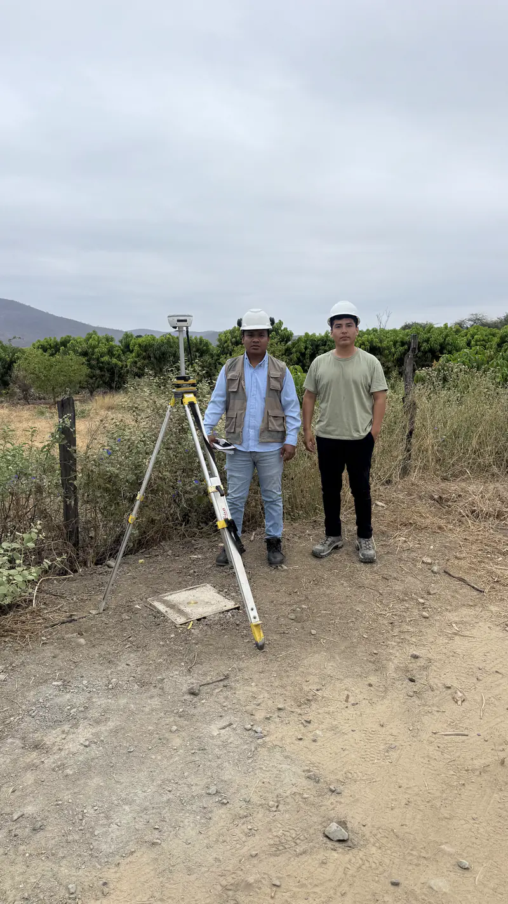
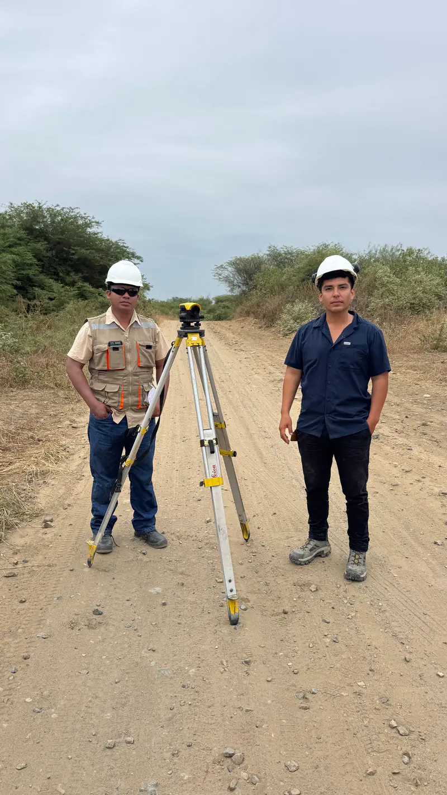
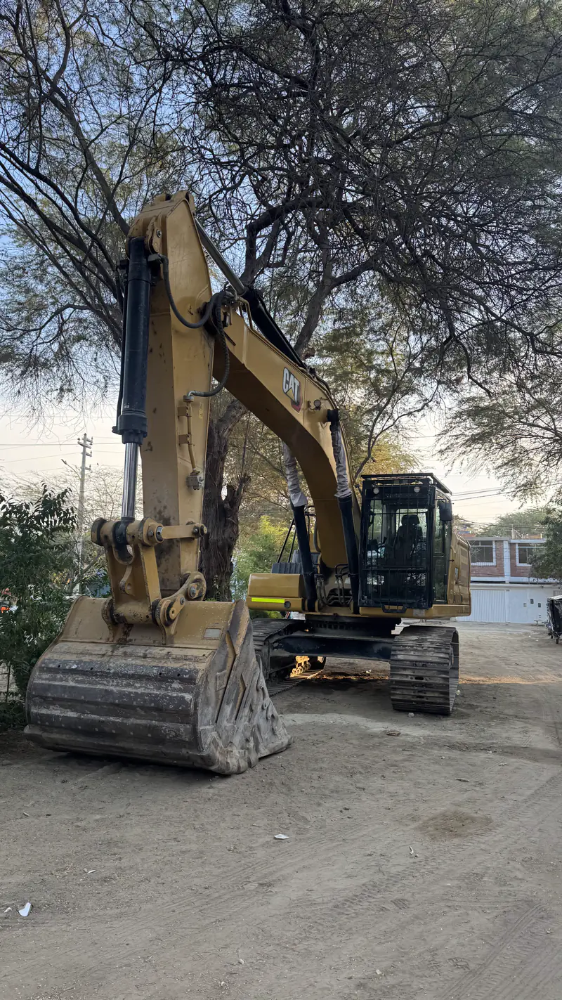
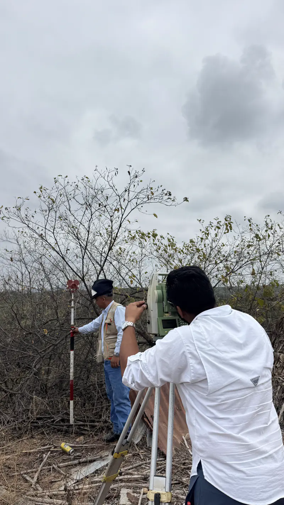

---

### SECCIÓN 10: PROYECTOS EMBLEMÁTICOS
* **Función:** Portafolio de obras finalizadas o en ejecución clasificado por región.
* **Proyectos destacados:**
  1. Planta Agroindustrial Los Ejidos (Movimiento de tierras masivo y plataforma).
  2. Defensas Ribereñas y Vía de Evitamiento (Terraplenes y diques de contención).
  3. Habilitación Urbana y Drenaje Pluvial (Redes de conducción y rasantes viales).
* **Imágenes incluidas:**
  * Proyecto Planta Agroindustrial: `src/assets/images/pro-planta-agro.webp`
  * Proyecto Los Ejidos: `src/assets/images/pro-ejidos.webp`
  * Proyecto Vía y Drenaje: `src/assets/images/pro-via-drenaje.webp`

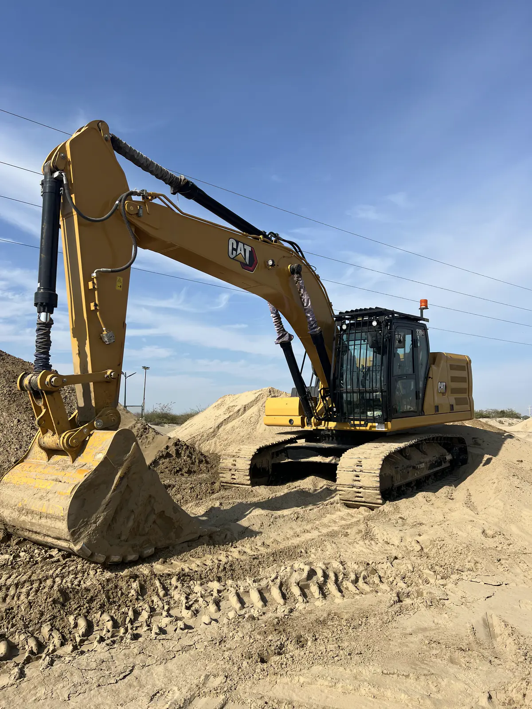
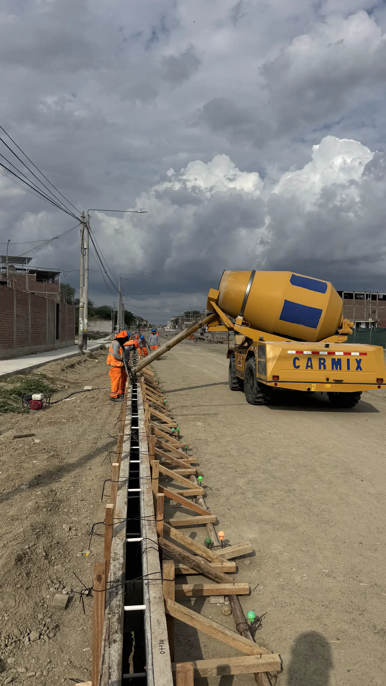

---

### SECCIÓN 11: BITÁCORA DE OBRA
* **Función:** Registro cronológico de actividades constructivas recientes con fechas, ubicaciones y descripciones técnicas.
* **Elementos que incluye:** Tarjetas con fecha formal, tags de sede (*Piura / Trujillo*), descripción del frente de trabajo e imagen de sustento.
* **Imágenes incluidas:**
  * Fotografías georreferenciadas de actividades diarias (`obra-1096.webp`, `obra-4827.webp`, `obra-7678.webp`, `obra-3178.webp`, `obra-0190.webp`).

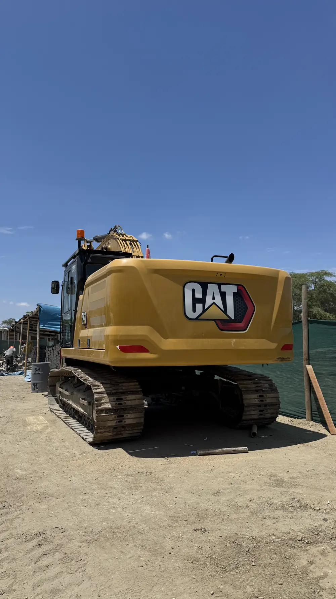

---

### SECCIÓN 12: GALERÍA FOTOGRÁFICA INTERACTIVA CON SISTEMA DE ZOOM
* **Función:** Exhibición fotográfica de alta resolución clasificada por áreas técnicas, con vista compacta y visor de aumento profesional.
* **Categorías de filtrado:**
  1. **Todas:** Vista global balanceada. Inicialmente muestra **6 fotografías clave** para mantener la página ligera y compacta.
  2. **Topografía:** Fotografías reales de alta precisión tomadas en la obra "Las Lomas":
     * Cuadrilla con receptor GNSS diferencial sobre hito geodésico (`topo-lomas-4.webp`).
     * Estación total Leica calibrada sobre hito de concreto en canal (`topo-1.webp`).
     * Topógrafo visualizando prisma en terreno agreste (`topo-lomas-1.webp`).
     * Detalle macro de nivelación electrónica Leica PinPoint (`topo-lomas-extra.webp`).
     * Nivel óptico Leica NA332 para control altimétrico (`topo-2.webp`).
  3. **Maquinaria:** Tres máquinas distintas reales trabajando en frente: Excavadora 20T, Cargador Frontal y Retroexcavadora CAT (`maq-excavadora.webp`, `maq-cargador.webp`, `maq-retro-obra.webp`).
  4. **Obras Viales:** Motoniveladora Komatsu conformando rasante y vías de acceso (`gal-4.webp`, `vial-apertura.webp`, `vial-rasante.webp`).
  5. **Edificaciones:** Estructuras de concreto armado, columnas y zapatas (`edif-estructura-1.webp`, `edif-estructura-2.webp`).
  6. **Grenco Soldadura:** Trabajos reales de taller y campo en acero y tuberías (`sold-3128.webp`, `sold-0191.webp`, `sold-entubado-1.webp`).
* **Botón con Relieve Neumórfico:**
  * Botón interactivo con sombra 3D convexa: *"Ver más fotos"*. Al presionarse, se expande a la totalidad de las imágenes y se transforma en *"Ver menos fotos"*.
* **Sistema de Zoom y Exploración 2D en Lightbox:**
  * **Aumento con Clic / Doble Clic:** Clic sobre la foto amplía instantáneamente a 240% hacia el punto pulsado.
  * **Aumento con Rueda del Mouse:** Zoom progresivo desde 100% hasta 400% sin desplazar la página.
  * **Arrastre y Paneo 2D (Pan & Drag):** Cursor tipo agarre (`grab/grabbing`) para desplazarse fluidamente en tiempo real a 60 fps e inspeccionar soldaduras, cotas topográficas y remates mecánicos.
  * **Barra de Herramientas Neumórfica:** Botón de alejar (`-`), porcentaje activo interactivo (`100%`, `150%`, `200%`), botón de acercar (`+`) y botón de restablecer (`↺`).
  * **Bloqueo Absoluto de Scroll y Cursor:** Al abrir el visor, el fondo queda totalmente congelado y oscurecido con desenfoque de 20 píxeles.
  * **Gestos Móviles:** Soporte completo para pellizco con dos dedos (*pinch-to-zoom*) y doble toque en teléfonos y tabletas.

#### Muestra de Fotografías Integradas en Galería:

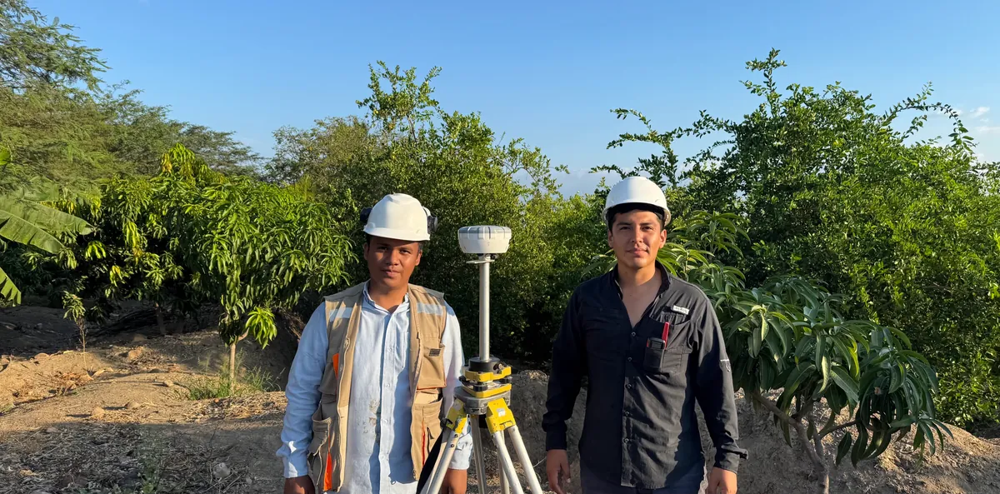
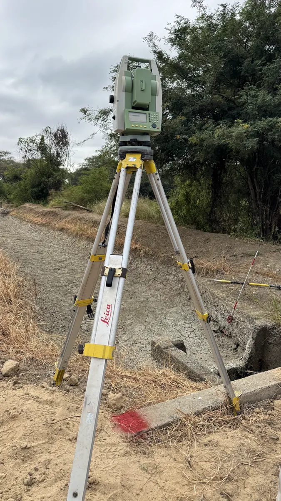
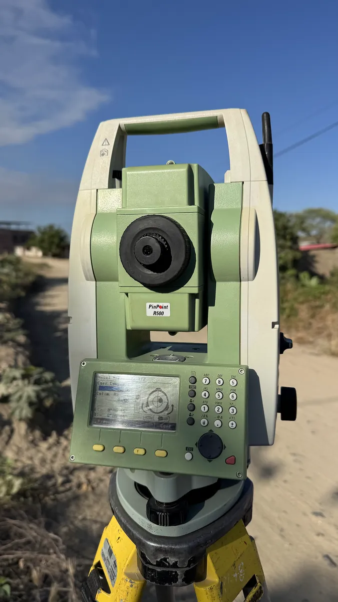
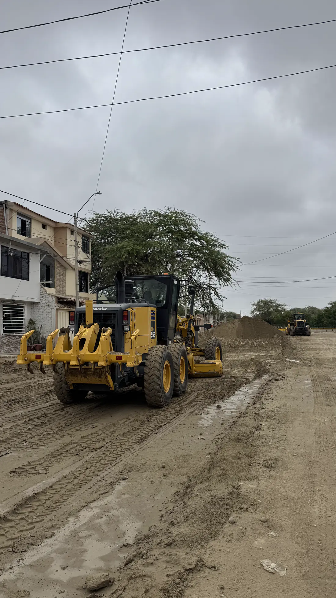
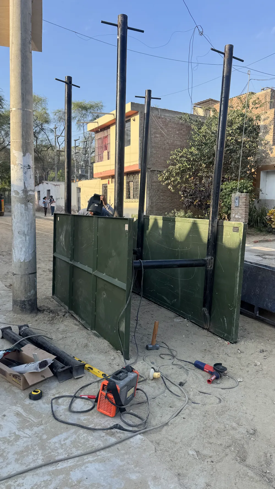
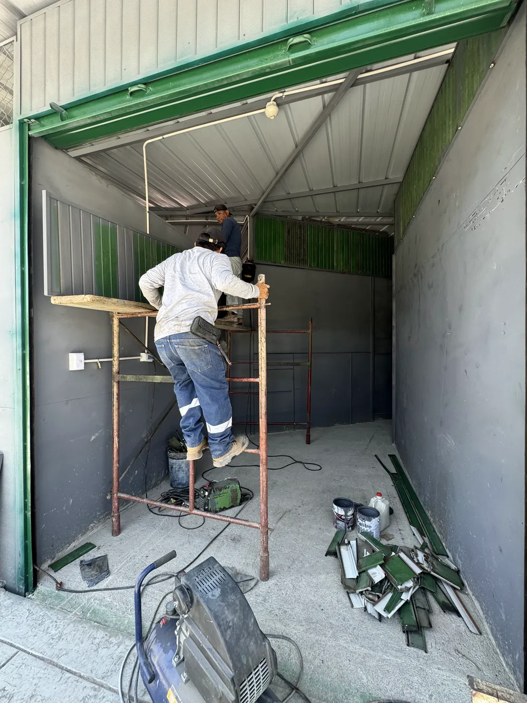
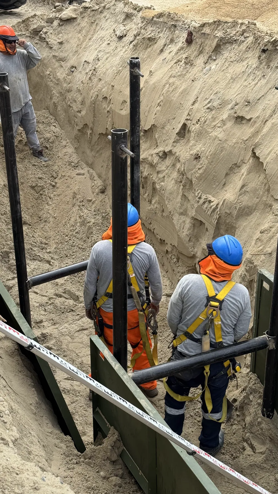
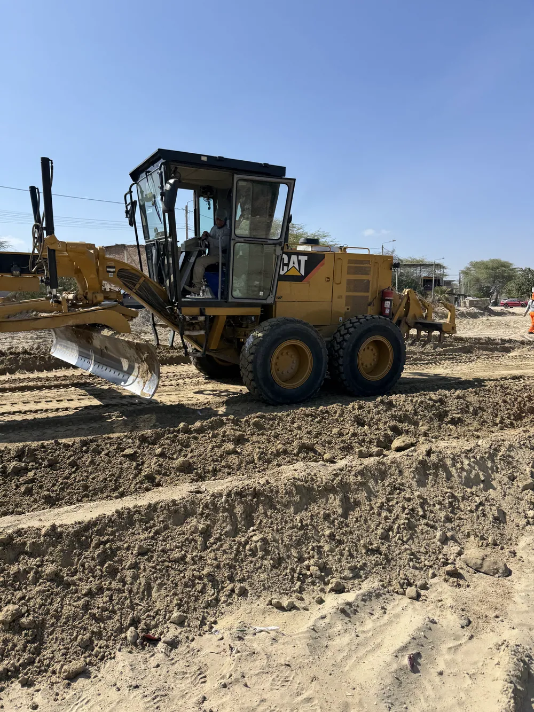

---

### SECCIÓN 13: CONTACTO Y COTIZACIONES
* **Función:** Canal de conversión para captar solicitudes de presupuesto de obra.
* **Elementos que incluye:**
  * Formulario formal con campos: Nombre, Empresa, Teléfono, Sede de interés (*Piura / Trujillo*), Tipo de servicio y Mensaje.
  * Direcciones físicas oficiales de base Piura y base Trujillo.
  * Enlace con un clic para iniciar conversación directa en WhatsApp institucional.
  * Horarios de atención comercial y correos corporativos.

---

### SECCIÓN 14: PIE DE PÁGINA (FOOTER)
* **Función:** Cierre legal, directorio corporativo y redes sociales.
* **Elementos que incluye:**
  * Enlaces a redes sociales oficiales: LinkedIn, Facebook, Instagram, TikTok y YouTube.
  * Leyenda de derechos de autor con año dinámico automático: `© [AÑO_ACTUAL] Grupo Enriquez Construcciones S.A.C.`
  * Indicación territorial: *Piura — Trujillo, Perú*.

---

### SECCIÓN 15: ELEMENTOS FLOTANTES DE SOPORTE
* **Botón Flotante de WhatsApp (FAB):** Acceso rápido siempre visible en la esquina inferior para consultas urgentes de cotización.
* **Botón "Volver Arriba":** Aparece automáticamente cuando el usuario ha descendido más allá de la portada para retornar a la cabecera en un toque.
* **Barra Inferior Fija (Sticky CTA):** Recordatorio sutil de contacto que aparece en pantallas móviles y de escritorio al navegar por los servicios.

---

## 6. RESUMEN DEL INVENTARIO MULTIMEDIA EN LA LANDING

| Tipo | Archivo / Nombre | Formato | Sección Donde se Utiliza | Descripción Técnica |
| :--- | :--- | :--- | :--- | :--- |
| **Video** | `piura-hero.mp4` | MP4 (H.264 720p) | Hero Sede Piura | Toma aérea de 12 segundos sobre el puente vehicular del Río Piura en bucle continuo |
| **Póster** | `piura-hero.webp` | WebP | Hero Sede Piura | Imagen estática de alta definición previa a la carga del video de Piura |
| **Video** | `trujillo.mp4` | MP4 (H.264 720p) | Hero Sede Trujillo | Toma aérea de 14 segundos sobre frente de obra en La Libertad |
| **Póster** | `trujillo.webp` | WebP | Hero Sede Trujillo | Imagen estática previa al video de Trujillo |
| **Video** | `servicio-movimiento.mp4` | MP4 (H.264 720p) | Servicios (Mov. Tierras) | Excavadoras en corte de terreno y carguío de volquetes |
| **Video** | `servicio-habilitacion.mp4` | MP4 (H.264 720p) | Servicios (Habilitación) | Motoniveladora y rodillo en conformación de subrasante |
| **Video** | `servicio-obras-civiles.mp4`| MP4 (H.264 720p) | Servicios (Obras Civiles) | Encofrado y vaciado de concreto estructural |
| **Video** | `servicio-soldadura.mp4` | MP4 (H.264 720p) | Servicios (Soldadura) | Soldadores especializados en estructuras metálicas y tubos |
| **Video** | `servicio-saneamiento.mp4`| MP4 (H.264 720p) | Servicios (Saneamiento) | Zanjas y tendido de tuberías para redes matrices |
| **Video** | `servicio-demolicion.mp4` | MP4 (H.264 720p) | Servicios (Demolición) | Demolición controlada y retiro de desmonte con volquetes |
| **Foto** | `topo-lomas-4.webp` | WebP | Galería (Topografía) | Cuadrilla con receptor GNSS diferencial en Las Lomas |
| **Foto** | `topo-1.webp` | WebP | Galería (Topografía) | Estación total Leica sobre hito geodésico |
| **Foto** | `topo-lomas-extra.webp` | WebP | Galería (Topografía) | Macro pantalla digital y plomada electrónica Leica |
| **Foto** | `topo-lomas-1.webp` | WebP | Galería (Topografía) | Operador topográfico con prisma en terreno agreste |
| **Foto** | `topo-2.webp` | WebP | Galería (Topografía) | Nivel óptico Leica NA332 para rasante |
| **Foto** | `topo-lomas-3.webp` | WebP | Galería (Topografía) | Cuadrilla midiendo eje de carretera con nivel |
| **Foto** | `maq-excavadora.webp` | WebP | Galería (Maquinaria) | Excavadora hidráulica sobre orugas CAT 20T |
| **Foto** | `maq-cargador.webp` | WebP | Galería (Maquinaria) | Cargador frontal CAT de gran capacidad |
| **Foto** | `maq-retro-obra.webp` | WebP | Galería (Maquinaria) | Retroexcavadora CAT 420F en excavación |
| **Foto** | `gal-4.webp` | WebP | Galería (Obras Viales) | Motoniveladora Komatsu en conformación de rasante urbana |
| **Foto** | `sold-3128.webp` | WebP | Galería (Soldadura) | Corte y soldadura de estructuras metálicas pesadas |
| **Foto** | `sold-0191.webp` | WebP | Galería (Soldadura) | Montaje y fijación de elementos de acero estructural |
| **Foto** | `sold-entubado-1.webp` | WebP | Galería (Soldadura) | Soldadura de tuberías hidráulicas en zanja |
| **Foto** | `edif-estructura-1.webp` | WebP | Galería (Edificaciones) | Vaciado y columnas de concreto armado |
| **Foto** | `edif-estructura-2.webp` | WebP | Galería (Edificaciones) | Muros de contención y losa aligerada |
| **Foto** | `pro-planta-agro.webp` | WebP | Proyectos | Plataforma de planta agroindustrial en Piura |
| **Foto** | `pro-ejidos.webp` | WebP | Proyectos | Movimiento de tierras y defensas Los Ejidos |
| **Foto** | `pro-via-drenaje.webp` | WebP | Proyectos | Construcción de vía canal y drenaje pluvial |
| **Foto** | `eq-residencia.webp` | WebP | Cultura y Equipo | Ingeniero residente revisando planos en campo |
| **Foto** | `eq-topografia.webp` | WebP | Cultura y Equipo | Especialista en estación total y georreferenciación |
| **Foto** | `eq-operador.webp` | WebP | Cultura y Equipo | Operador de maquinaria pesada con equipo de protección |
| **Foto** | `eq-ssoma.webp` | WebP | Cultura y Equipo | Ingeniero de Seguridad y Salud en el Trabajo |

---

## 7. CONCLUSIÓN

La landing page de **GRENCO** ha quedado configurada como un activo digital de alto estándar:
1. **Veracidad:** Muestra únicamente fotografías reales de cuadrillas, equipos y proyectos ejecutados, eliminando imágenes genéricas o creadas por inteligencia artificial.
2. **Interactividad:** Permite a los clientes evaluar de cerca la calidad técnica de las obras mediante un sistema de zoom y paneo táctil sin fricción.
3. **Optimización Extrema:** Tiempos de carga mínimos gracias al empaquetado WebP y la codificación de video con arranque rápido para conexiones móviles en obra.
4. **Sostenibilidad:** Código limpio, sin enlaces rotos y con actualización dinámica permanente de año fiscal.

---
*Documento preparado formalmente para la gerencia y equipo técnico de GRENCO (Grupo Enriquez Construcciones S.A.C.).*
